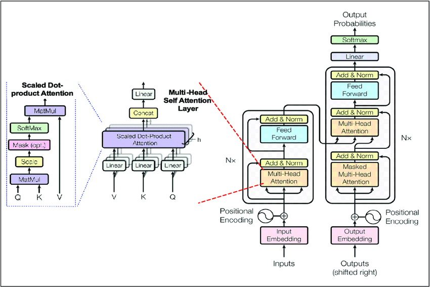
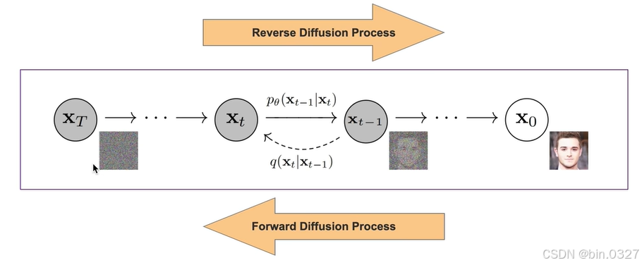

# From scratch

Implementation of classical deep learning models/algorithms in Python using some common libraries (numpy, torch, etc).

### 1) FeedForward neural network

  

Implementation of feedforward neural networks using numpy and tqdm only.  
An example is given in the notebook example.ipynb and a mathematical justification is given in the file theory.pdf.

### 2) Attention is all you need

  

Implementation of the transform architecture proposed in the paper Attention Is all You Need, encoder and decoder pre-training on French and English datasets, 
and then fine-tuning for French-to-English translation.

### 3) Denoising Diffusion Probabilistic Models

  

Implementation of the diffusion process proposed in DDPM paper and training on the MNIST dataset.  
The model used to predict noise (U-Net) is taken directly from Hugging Face's Diffuser library.
