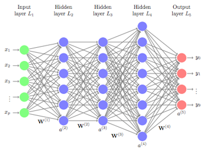

# Neural networks from scratch

  

Implementation of feedforward neural networks from scratch in Python (using only numpy and tqdm).  
An example is given in the notebook example.ipynb and a mathematical justification is given in the file theory.pdf.